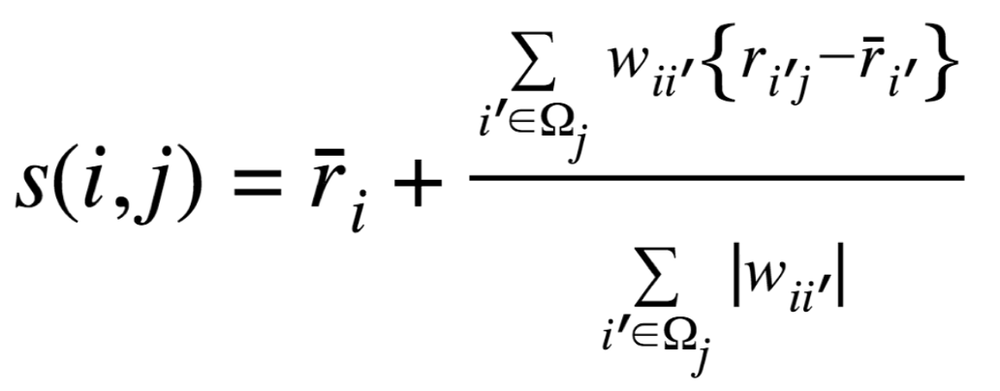

# User-Based Collaborative Filtering

## Công thức dự đoán
Hệ thống sử dụng công thức sau để dự đoán đánh giá 
𝑠(𝑖 , 𝑗) của người dùng 
𝑖 cho bộ phim 𝑗, dựa trên các đánh giá của những người dùng có sở thích tương tự 
𝑖′  (hàng xóm).



### Giải thích các thành phần trong công thức
- 𝑠(𝑖 , 𝑗) : Đánh giá dự đoán mà người dùng 𝑖 đưa ra cho bộ phim 𝑗.
- 𝑟̅(𝑖) : Đánh giá trung bình của người dùng 𝑖.
- 𝑟̅(𝑖′𝑗) : Đánh giá trung bình của người dùng 𝑖′ cho bộ phim 𝑗.
- 𝑤(𝑖, 𝑖′) : Hệ số tương quan Pearson giữa người dùng 𝑖 và người dùng 𝑖′.
- Ω(𝑗) : Tập hợp các hàng xóm của người dùng 𝑖' đã đánh giá bộ phim 𝑗.

### Công thức này hoạt động như sau:
1. Tính độ lệch so với trung bình 𝑟(𝑖′𝑗) − 𝑟̅(𝑖′) để xem người dùng 𝑖′ đánh giá bộ phim 𝑗 cao hơn hay thấp hơn so với trung bình.
2. Kết hợp độ lệch với trọng số tương đồng 𝑤(𝑖, 𝑖′) cho thấy mức độ ảnh hưởng của người dùng 𝑖′ đến người dùng 𝑖.
3. Chuẩn hóa bằng tổng trọng số Σ|𝑤(𝑖, 𝑖′)| để đảm bảo rằng dự đoán hợp lý.

## Cách sử dụng công thức
### Dự đoán đánh giá 
```python
def predict(i, m):
    numerator = 0
    denominator = 0
    for j, w in neighbors[i]:  # Duyệt qua danh sách hàng xóm
        try:
            numerator += w * deviations[j][m]  # Tổng trọng số * độ lệch
            denominator += abs(w)             # Tổng trọng số
        except KeyError:
            # Người dùng j chưa đánh giá phim m
            pass

    if denominator == 0:
        prediction = averages[i]  # Sử dụng trung bình của người dùng i
    else:
        prediction = averages[i] + numerator / denominator

    return prediction
```

### Tính trọng số tương quan Pearson
```python
def calculate_similarity(i, j):
    common_movies = user2movie_train[i] & user2movie_train[j]
    if len(common_movies) == 0:
        return 0  # Không có phim chung

    # Lấy các giá trị đánh giá và trung bình
    avg_i = averages[i]
    avg_j = averages[j]

    # Tính toán các thành phần của Pearson
    num = sum(
        (usermovie2rating_train[(i, m)] - avg_i) *
        (usermovie2rating_train[(j, m)] - avg_j)
        for m in common_movies
    )
    den1 = sqrt(sum(
        (usermovie2rating_train[(i, m)] - avg_i)**2
        for m in common_movies
    ))
    den2 = sqrt(sum(
        (usermovie2rating_train[(j, m)] - avg_j)**2
        for m in common_movies
    ))

    if den1 == 0 or den2 == 0:
        return 0  # Không có tương quan

    return num / (den1 * den2)
```

