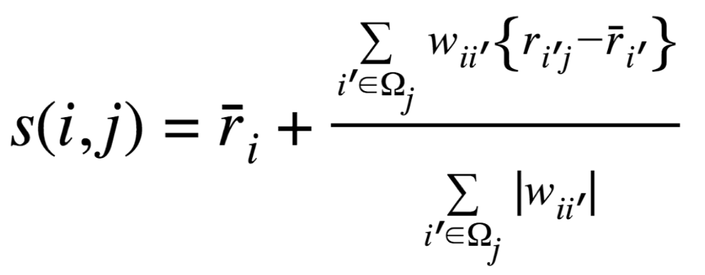
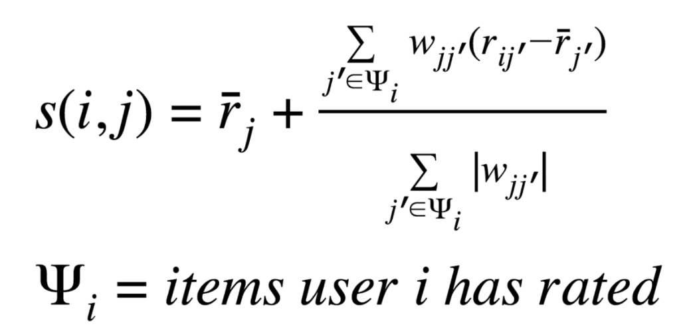
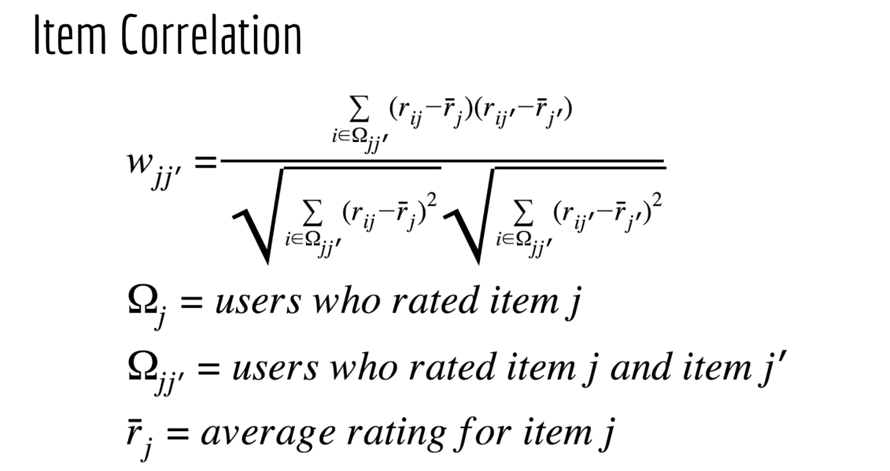

# Collaborative Filtering

## Công thức dự đoán User-Based CF
Sử dụng khi hệ thống có user nhiều hơn item, dễ dàng mở rộng khi thêm mục mới, vì không cần tính toán lại điểm tương đồng.

## Công thức dự đoán Item-Based CF
Sử dụng khi hệ thống có item nhiều hơn user, phù hợp khi các mục được đánh giá nhiều lần và điểm tương đồng giữa các mục ít thay đổi.

