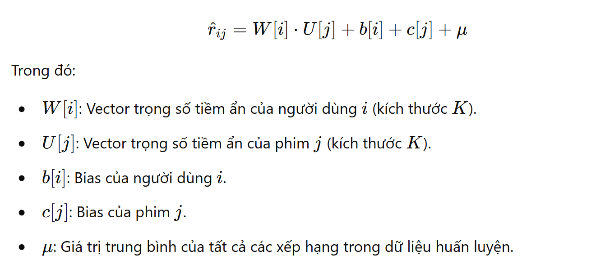

# Phân rã ma trận (Matrix Factorization)
## 1. Tổng quan
### 1.1. Mục tiêu
Dự đoán xếp hạng r(i,j) của người dùng i cho phim j bằng cách tối ưu các ma trận trọng số tiềm ẩn W (user factors) và U (item factors), cùng với các bias b (user bias) và c (item bias).
### 1.2. Hàm dự đoán

## 2. Thuật toán
### 2.1. Tải dữ liệu
### 2.2. Khởi tạo tham số

- Số chiều tiềm ẩn K được đặt trước (ở đây K=10).
- Khởi tạo:
    - W: ma trận user factors với kích thước (n_users, K).
    - U: ma trận item factors với kích thước (n_items, K).
    - b, c: bias của user và item.
    - μ: Giá trị trung bình của tất cả xếp hạng trong tập huấn luyện.
### 2.3. Hàm tính lỗi

### 2.4. Huấn luyện tham số
- Sử dụng thuật toán Stochastic Gradient Descent (SGD) để tối ưu hàm lỗi kết hợp với Regularation để tối ưu hóa các tham số W, U, b, c.

## 3. So sánh
### 3.1. So sánh với Collaborative Filtering
- Collaborative Filtering: Dựa vào sự tương tác giữa người dùng và sản phẩm.
- Matrix Factorization: Dựa vào các đặc trưng tiềm ẩn của người dùng và sản phẩm.
- Matrix Factorization thường cho kết quả tốt hơn khi dữ liệu thưa (sparsity) và có thể mở rộng dễ dàng hơn.
- Collaborative Filtering thường cho kết quả tốt hơn khi dữ liệu mật (dense).

### 3.2. Ưu điểm và nhược điểm
#### 3.2.1. Ưu điểm
- Phương pháp dựa trên phân rã ma trận là nền tảng cho nhiều hệ thống gợi ý hiệu quả (như Netflix và Amazon).
- Tối ưu hóa cả hai chiều: người dùng và mục.
- Sử dụng bias (b,c) giúp cải thiện độ chính xác bằng cách tính đến đặc điểm riêng của từng người dùng và mục.
#### 3.2.2. Nhược điểm
- Tốn thời gian tính toán, đặc biệt khi dữ liệu lớn.
- Cần xử lý tốt dữ liệu bị thiếu (sparse data), vì ma trận W và U phụ thuộc vào lượng dữ liệu có sẵn.
- Regularization cần được chọn cẩn thận để tránh overfitting hoặc underfitting.

